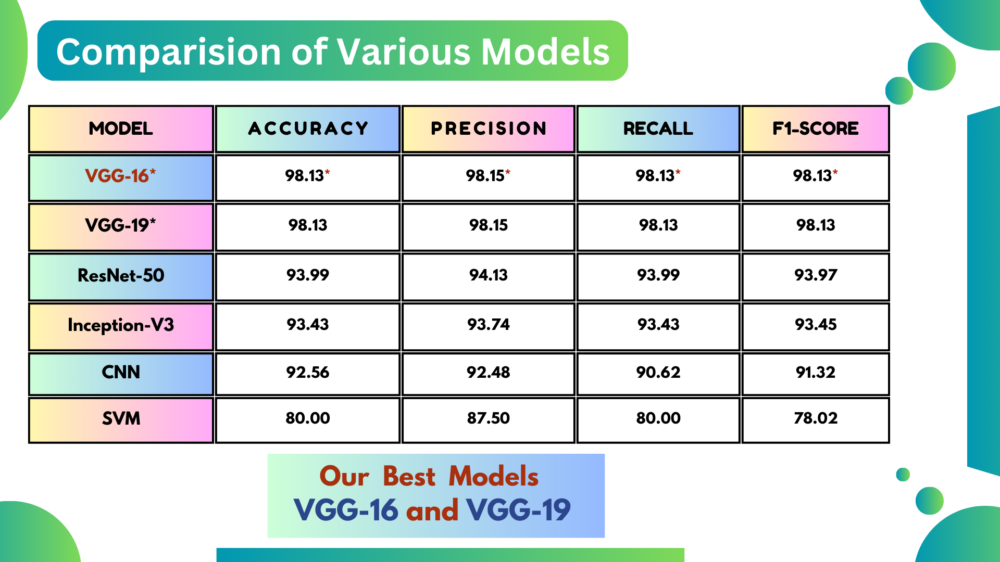

<h1 style="color: #4CAF50; text-align: center;">🌿 Plant Disease Detection and Classification using Deep Learning Approaches 🌿</h1>

<h2 style="color: #f39c12;">Project Overview</h2>

This project aims to develop an efficient system for detecting and classifying plant diseases from leaf images using advanced deep learning techniques. Accurate and timely identification of plant diseases is crucial for effective agricultural production and management.

<h2 style="color: #f39c12;">Team Members</h2>
<ul>
  <li><strong>NENAVATH DEEPAK</strong> (1602-20-735-128)</li>
  <li><strong>MOHAMMED RIZWAN</strong> (1602-20-735-139) <em>(Myself)</em></li>
  <li><strong>MOHAMMED SAMEER</strong> (1602-20-735-140)</li>
</ul>

<h2 style="color: #f39c12;">Guide</h2>

<strong>Dr. S. Aruna Deepthi</strong> Assistant Professor, Vasavi College of Engineering

<h2 style="color: #f39c12;">Algorithms Used</h2>

<h3 style="color: #3498db;">Convolutional Neural Network (CNN)</h3>

We employed a CNN model for initial image processing and classification.

<a href="https://www.kaggle.com/rizwan139/batch-13-plant-disease-clasification-cnn" style="color: #e74c3c;">Batch 13 - Plant Disease Classification CNN</a>

<h3 style="color: #3498db;">Transfer Learning with Pre-trained Models</h3>

To enhance model accuracy and robustness, we utilized the following pre-trained models:

<ul>
  <li><strong>Inception-V3</strong> <a href="https://www.kaggle.com/rizwan139/batch-13-plant-diseases-inceptionv3" style="color: #e74c3c;">Batch 13 - Plant Diseases InceptionV3</a></li>
  <li><strong>ResNet-50</strong> <a href="https://www.kaggle.com/rizwan139/batch-13-plant-disease-resnet-50" style="color: #e74c3c;">Batch 13 - Plant Disease ResNet-50</a></li>
  <li><strong>VGG-16</strong> <a href="https://www.kaggle.com/code/rizwn139/batch-13-vgg16-plant-disease-detection" style="color: #e74c3c;">Batch 13 - VGG16 Plant Disease Detection</a></li>
  <li><strong>VGG-19</strong> <a href="https://www.kaggle.com/code/rizwan139/batch-13-vgg-19-plant-disease-detection" style="color: #e74c3c;">Batch 13 - VGG-19 Plant Disease Detection</a></li>
</ul>

<h2 style="color: #f39c12;">Final Report</h2>

For an in-depth understanding of our approach, methods, and results, you can refer to our final report.

<a href="https://drive.google.com/file/d/1mwxPPo9gyDF7CcC_ttMPOXC4r8w2mH36/view?usp=sharing" style="color: #e74c3c;">Final Report</a>

<h2 style="color: #f39c12;">Final Presentation</h2>

Our final presentation provides a summarized overview of the project and its outcomes.

<ul>
  <li><a href="https://www.canva.com/design/DAF9aGL963Q/euigTJQt1erGdMJlnHt-nQ/view?utm_content=DAF9aGL963Q&utm_campaign=designshare&utm_medium=link&utm_source=editor" style="color: #e74c3c;">Final PPT on Canva</a></li>
  <li><a href="https://docs.google.com/presentation/d/1ElRg8FdVfWfMekqXq_3Yj2rJF__uOXNm/edit?usp=sharing&ouid=110673703629902288166&rtpof=true&sd=true" style="color: #e74c3c;">Final PPT on Google Slides</a></li>
</ul>

<h2 style="color: #f39c12;">Conclusion</h2>

This project successfully demonstrates the application of deep learning techniques to the field of plant disease detection and classification. By leveraging both CNNs and transfer learning with pre-trained models, we achieved significant improvements in accuracy and reliability.

 <!-- Replace this URL with your actual image URL -->
